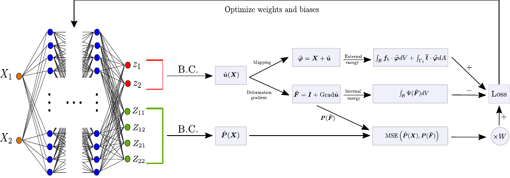
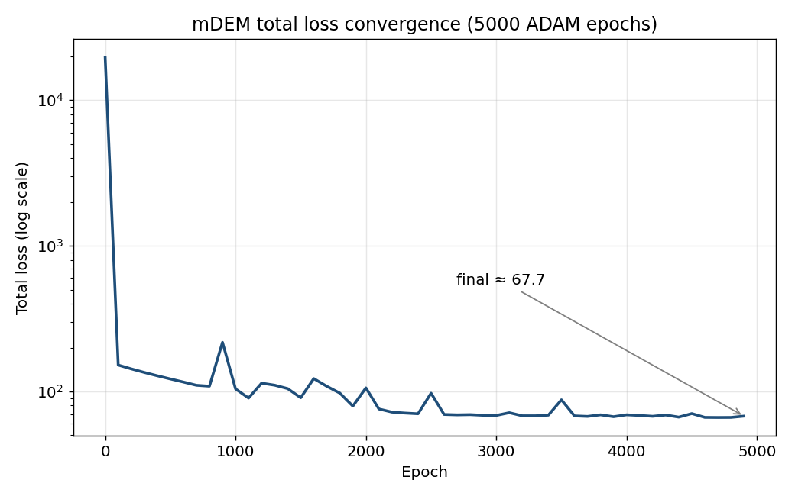
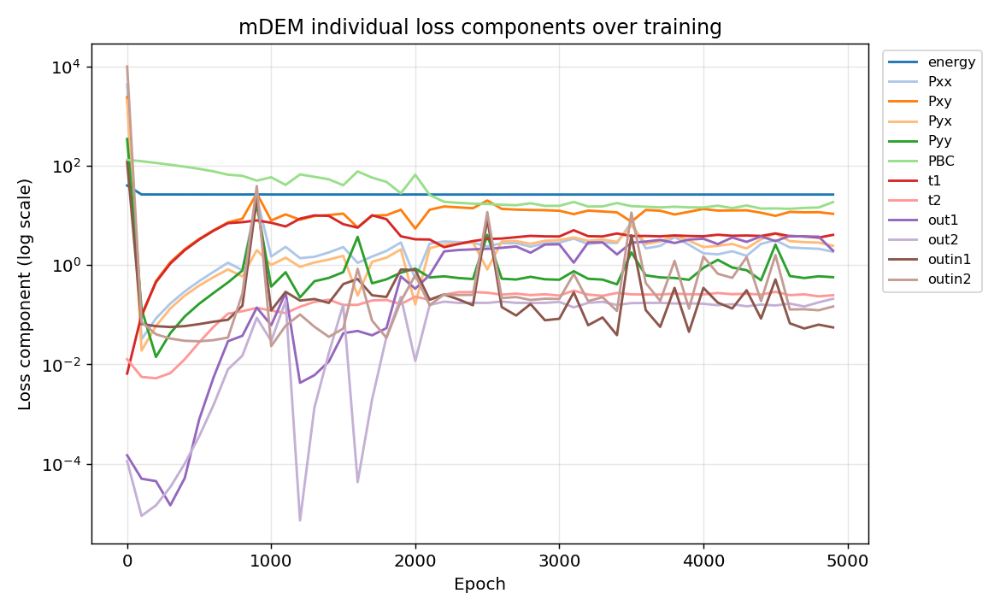

# mDEM — Loss-Ablation Study of the mixed Deep Energy Method

A study and extension of the **mixed Deep Energy Method (mDEM)** for finite-strain
hyperelasticity, carried out as part of my MEng Individual Research Project.

> **What this is, honestly:** I took the published mDEM research code by Fuhg &
> Bouklas, worked to fully understand it, instrumented it to log every loss term
> during training, and analysed *which* losses drive (and stall) convergence on
> the 2D "plate-with-a-hole" benchmark. I also began two extensions — a
> Coefficient-of-Variation (CoV) loss-weighting scheme and a body-force
> correction to the stress-residual losses. The original physics and network are
> the work of Fuhg & Bouklas; my contribution is the analysis and the
> (in-progress) extensions described below.

<p align="center">

</p>

---

## Background

The Deep Energy Method (DEM) trains a neural network to predict a displacement
field by minimising the system's total potential energy, rather than fitting
labelled data. The **mixed** DEM (Fuhg & Bouklas, 2022) adds the stress measures
as extra network outputs to better resolve stress concentrations in finite-strain
hyperelasticity. The benchmark used here is a 2D square plate with a circular
hole under tension, with a Neo-Hookean material model.

---

## My contributions

- **Comprehended and annotated the research code.** Added interpretive comments
  throughout the training loop (`mdem/run_hole_problem.py`) explaining the energy
  loss, deformation-gradient and stress (Piola–Kirchhoff) calculations, and each
  of the ~13 individual loss terms.
- **Built a loss-ablation study.** Instrumented the ADAM training loop to record
  every loss component every 100 epochs and export it (`ablation_losses.xlsx`),
  enabling per-term analysis of convergence behaviour over 5000 epochs.
- **Diagnosed the convergence bottleneck.** The Dirichlet/stress-boundary term
  (`PBC`) dominates the residual while the energy term stalls around ~26.5; a
  coupled spike near epoch 900 points to shared-parameter sensitivity. See
  *Results* below.
- **Derived a body-force correction (on paper).** The original stress-residual
  losses apply Cauchy's law while neglecting body forces — relevant once gravity
  matters. The corrected approximation is derived in my thesis.
- **Added a CoV loss-weighting extension** (`CoV/`) to balance the competing loss
  terms automatically. After fixing an autograd-graph bug it now trains; whether
  it improves on the unweighted baseline is still open — see *Limitations*.

---

## Results

All figures below are generated from the logged ablation data in
`ablation losses investigation/OG/OG_ablation_losses.xlsx`.

**Total loss convergence.** Total loss falls from ~19,700 to ~67.7 over 5000
epochs, then plateaus. The spike near epoch 900 is discussed below.

<p align="center">

</p>

**Per-term breakdown.** Plotting each loss component separately shows the energy
term flattening early (stuck ~26.5) while the boundary/stress terms (`PBC`,
`Pxy`) dominate the remaining loss — i.e. the plateau is driven by the boundary
conditions, not the energy objective. Several coupled terms spike together near
epoch 900, consistent with shared-parameter dependence.

<p align="center">

</p>

> Note: the displacement-boundary term (`boundary`) is identically zero because
> the Dirichlet conditions are imposed as a hard constraint in the network output
> (`getU`), so it is omitted from the per-term plot.

---

## Repository layout

```
mdem/        # main model, training loop, and the hole-problem definition
CoV/         # (experimental) Coefficient-of-Variation loss weighting
utilities/   # numerical integration and helper utilities
output/      # images (figures + scheme) and ParaView (.vtu) output location
ablation losses investigation/   # archived ablation run data (.xlsx)
```

---

## Installation

Requires a [conda](https://docs.conda.io/en/latest/miniconda.html) environment.

```bash
git clone https://github.com/cramroc/mDEM.git
cd mDEM
conda env create -f environment.yml
conda activate mixedDEM
python -m pip install . --user
```

## Usage

```bash
python -m mdem
```

Simulation output is written to `output/vtk_files/` as `.vtu` files, viewable in
[ParaView](https://www.paraview.org/). Loss data for the ablation study is
written to `ablation_losses.xlsx`.

> By default `CoVFlag = True` in `run_hole_problem.py`, which runs the
> CoV-weighted training. Set `CoVFlag = False` for the unweighted baseline.

---

## Limitations & future work

This is a research/analysis project, not a finished, validated solver. Honest
status:

- **CoV weighting trains, but isn't yet shown to be *better*.** The original
  autograd-graph bug (the loss vector was detached from the network, so no
  gradients flowed) has been fixed, and the CoV-weighted path now trains. Whether
  it actually improves convergence versus the unweighted baseline is not yet
  established — a controlled with/without comparison is the next step.
- **No FEM baseline / validation.** Results are reported as loss values only;
  there is no ground-truth displacement/stress comparison against a finite-element
  solution, so absolute accuracy is not yet quantified.
- **Single-scenario training.** The model trains on one deformation case, making
  it sensitive to noise (the spikes) rather than learning a generalisable model.
- **Benchmark geometry only.** This is the paper's 2D plate-with-a-hole with
  generic parameters (E = 1000, ν = 0.3) — not a specific application geometry or
  material.

Planned next steps: fix the CoV autograd issue and quantify whether it helps;
implement the derived body-force correction; build an FEM baseline for validation.

---

## Attribution

This work builds directly on the original mDEM implementation and method by
**Jan N. Fuhg and Nikolaos Bouklas** (Cornell University). The neural-network
model, energy formulation, and hole-problem setup are theirs; this fork adds the
loss-ablation instrumentation, analysis, and the in-progress extensions described
above.

### References

[1] Fuhg, J. N., & Bouklas, N. (2022). *The mixed deep energy method for
resolving concentration features in finite strain hyperelasticity.* Journal of
Computational Physics, 451, 110839.

[2] Nguyen-Thanh, V. M., Zhuang, X., & Rabczuk, T. (2020). *A deep energy method
for finite deformation hyperelasticity.* European Journal of Mechanics-A/Solids,
80, 103874.

---

## License

This package inherits the licensing of the original work. It comes with
ABSOLUTELY NO WARRANTY and is free software, redistributable under the GNU
General Public License ([GPLv3](http://www.fsf.org/licensing/licenses/gpl.html)).
Contents are published under the Creative Commons
Attribution-NonCommercial-ShareAlike 4.0 International License
([CC BY-NC-SA 4.0](http://creativecommons.org/licenses/by-nc-sa/4.0/)).
